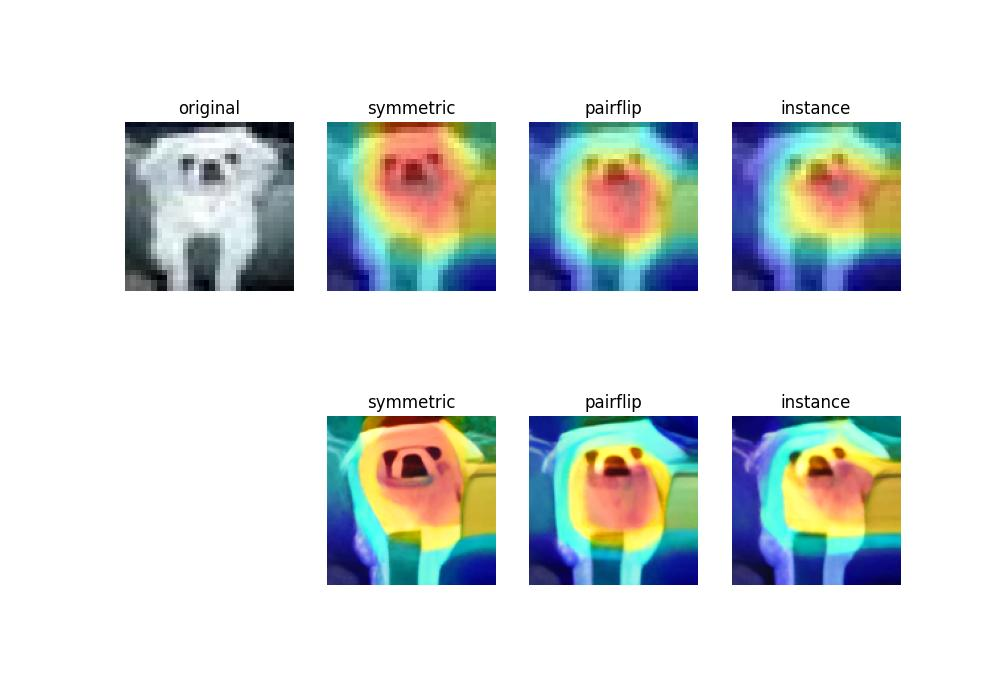

# Visualize Model with GradCAM and Super-Resolution
Visualizing the model for the following paper at NeurIPS 2021 and ECCV 2022
## [Understanding and Improving Early Stopping for Learning with Noisy Labels](https://github.com/tmllab/PES) 
## [From Face to Natural Image: Learning Real Degradation for Blind Image Super-Resolution](https://github.com/csxmli2016/ReDegNet)


## Experiments

1. Setup Environments:
```
git clone https://github.com/Waterkin/PES_ReDegNet_GradCAM.git
conda create -n noisy python=3.8
conda activate noisy
pip install -r requirements.txt
cd ReDegNet
python setup.py develop
```

> 📋 Please download and place all datasets into the data directory. For cifar10, download it by yourself.

2. To train PES on CIFAR-10/100:
```
python PES_semi.py --dataset cifar10 --noise_type symmetric --noise_rate 0.5
python PES_semi.py --dataset cifar10 --noise_type instance --noise_rate 0.4  --lambda_u 15
python PES_semi.py --dataset cifar100 --noise_type pairflip --noise_rate 0.45  --lambda_u 50
```

3. To generate GradCAM images:
```
python flask_cam.py
```